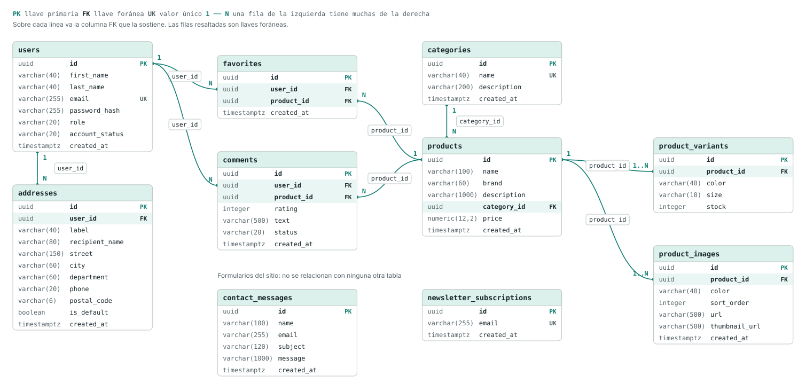

# Andanza — Backend

API REST del e-commerce de calzado Andanza. Proyecto de Sena.

Este repositorio es el backend. El frontend (React) vive aparte, en [andanza-frontend](https://github.com/Kevin-richarzon-jimenez/andanza-frontend), y ambos se comunican solo por API.

## Stack

- **Java 21** (LTS)
- **Spring Boot 4.1.1** con Maven (incluye Maven Wrapper: no hace falta instalar Maven)
- **Spring Web** — API REST
- **Spring Data JPA** + driver de **PostgreSQL** — la base de datos es Postgres, alojada en [Supabase](https://supabase.com) y consumida directamente por JDBC/JPA (sin usar la API/Auth propia de Supabase)
- **Flyway** — crea y versiona el esquema de la base de datos con archivos SQL
- **Spring Security** — autenticación con tokens JWT y contraseñas con BCrypt
- **Spring Boot Validation** — validación de los datos de entrada
- **Spring Boot Actuator** — health check en `/actuator/health`
- **springdoc-openapi** — documentación interactiva de la API (Swagger UI)
- **Lombok** y **DevTools**

## Requisitos

- Java 21
- Una base de datos Postgres: la del proyecto en Supabase, o una local (por ejemplo, en Docker)

## Configuración

La app necesita estas variables (las que no tienen valor por defecto son obligatorias):

| Variable | Para qué sirve | Por defecto |
|---|---|---|
| `DB_URL`, `DB_USERNAME`, `DB_PASSWORD` | Conexión a la base de datos | `localhost:5432/andanza`, `postgres` / `postgres` |
| `JWT_SECRET` | Secreto con el que se firman los tokens de sesión (mínimo 32 caracteres) | — (obligatoria) |
| `CORS_ALLOWED_ORIGINS` | Orígenes del frontend autorizados, separados por coma | `http://localhost:5173` |
| `JWT_EXPIRATION_MINUTES` | Duración de la sesión | `120` |
| `SWAGGER_ENABLED` | Activa Swagger UI y el JSON de la API (en producción, `false`) | `true` |
| `PORT` | Puerto de la API | `8080` |

Lo más cómodo es un perfil local, un archivo que nunca se sube al repositorio:

1. Copiar `src/main/resources/application-local.properties.example` como `src/main/resources/application-local.properties` (está en `.gitignore`).
2. Completar los valores reales. El archivo de ejemplo explica cada uno.

Si el sistema ya tiene definida alguna de esas variables de entorno, esa tiene prioridad sobre el archivo.

**Supabase:** usar las credenciales del *Session Pooler*, que se encuentran en el dashboard del proyecto: botón **Connect** → **Direct connection** → pestaña **Session pooler**. La conexión directa solo funciona por IPv6, que la mayoría de las redes no soporta. La API key de Supabase no reemplaza la contraseña de Postgres y no se usa en este proyecto.

## Ejecutar

```
./mvnw spring-boot:run -Dspring-boot.run.profiles=local
```

La API queda en `http://localhost:8080`. Al arrancar, Flyway aplica las migraciones que falten. Si las variables se pasan por el entorno en lugar del perfil local, se omite `-Dspring-boot.run.profiles=local`.

- Estado de la app: `http://localhost:8080/actuator/health` (el detalle de la conexión a la base de datos lo ve el administrador con su token)
- Documentación interactiva de la API (Swagger UI): `http://localhost:8080/swagger-ui.html`

## Base de datos

El esquema no se toca a mano en Supabase: vive en archivos de migración en `src/main/resources/db/migration`, con el nombre `V<número>__<descripción>.sql`. Flyway los aplica en orden al arrancar y guarda el registro en la tabla `flyway_schema_history`. Hibernate solo **valida** que las entidades coincidan con las tablas (`ddl-auto=validate`).

- Para cambiar el esquema se agrega una migración nueva (`V3__...`); una migración ya aplicada nunca se edita.
- Las tablas van en inglés, en plural y en snake_case (`products`, `product_variants`); los ids son `uuid`.
- Toda tabla nueva debe activar `ENABLE ROW LEVEL SECURITY`: Supabase expone el esquema `public` por su API REST, y sin esa línea cualquiera con la clave pública podría leerla o modificarla. El backend se conecta con el rol `postgres` y no se ve afectado. La tabla de historial de Flyway la protege el ajuste de Supabase que activa RLS en toda tabla nueva de `public` (activo en el proyecto del equipo); en otro proyecto, revisar que esté activo.
- `V2__seed_demo_catalog.sql` carga las categorías base y cinco productos de ejemplo con sus variantes.

### Primer administrador

Los endpoints de `/admin` exigen el rol `ADMIN`. Como todo el equipo usa la misma base, esto se hace **una sola vez**:

1. Registrarse con tu correo real: `POST /api/v1/auth/register` (se puede hacer desde Swagger UI).
2. En Supabase, en el *SQL Editor*, subir ese usuario de rol: `update users set role = 'ADMIN' where email = 'tu@correo.com';`
3. Listo: el rol se lee de la base en cada petición, así que vale de inmediato, sin volver a iniciar sesión.

Desde ahí, ese administrador puede darle el rol a otras cuentas con `PUT /api/v1/admin/users/{id}`.

### Modelo de datos

Cada caja es una tabla de Supabase, con los nombres exactos de tablas y columnas; las líneas son las llaves foráneas. Un producto guarda lo común (nombre, marca, precio) y cada combinación de color y talla es una variante con su propio stock; favoritos y comentarios cuelgan del producto, no de la variante.



| Tabla | Reglas que la base hace cumplir |
|---|---|
| `users` | Correo único sin distinguir mayúsculas; contraseña con BCrypt |
| `addresses` | Una sola dirección predeterminada por usuario; se borra con el usuario |
| `categories` | Nombre único sin distinguir mayúsculas; no se borra si tiene productos |
| `products` | Precio mayor a 0; siempre pertenece a una categoría |
| `product_variants` | Stock nunca negativo; no se repite la combinación producto + color + talla; se borra con el producto |
| `favorites` | Un usuario no marca dos veces el mismo producto |
| `comments` | Calificación de 1 a 5 y texto de 5 a 500 caracteres; `PENDING` hasta que un administrador lo aprueba |
| `contact_messages` | Mensajes del formulario de contacto, sin relación con usuarios |
| `newsletter_subscriptions` | Correo único sin distinguir mayúsculas |

## Compilar y probar

```
./mvnw clean package -DskipTests
```

Genera un `.jar` ejecutable en `target/`. Los tests unitarios de la lógica de negocio (carrito, productos de administración y autenticación) no necesitan base de datos: `./mvnw test -Dtest='*ServiceTest'`. El test de arranque completo (`AndanzaBackendApplicationTests`) sí la necesita, junto con las variables de arriba: `./mvnw test -Dspring.profiles.active=local`.

## API

Todos los endpoints cuelgan de `/api/v1`. El detalle de cada uno (campos, validaciones y respuestas) está en Swagger UI.

**Autenticación:** `POST /auth/login` y `POST /auth/register` devuelven un `token`. Los endpoints protegidos lo esperan en el header `Authorization: Bearer <token>`. El usuario se identifica solo por el token: nunca se envía su id en el body ni en la URL.

| Recurso | Endpoints | Acceso |
|---|---|---|
| Catálogo | `GET /catalog/products` (filtros y paginación por query params), `GET /catalog/products/{id}`, `GET /catalog/categories`, `GET /catalog/filter-options` (tallas, colores y rango de precios que existen) | Público |
| Carrito | `POST /cart/totals` | Público |
| Autenticación | `POST /auth/register`, `POST /auth/login` | Público |
| Autenticación | `PUT /auth/password` | Usuario |
| Direcciones | `GET` y `POST /account/addresses`, `PUT` y `DELETE /account/addresses/{id}` | Usuario |
| Favoritos | `GET /favorites`, `PUT` y `DELETE /favorites/{productId}` | Usuario |
| Comentarios | `GET /comments?productId=` (solo los aprobados) | Público |
| Comentarios | `POST /comments`, `GET /account/comments` | Usuario |
| Contacto | `POST /contact-messages`, `POST /newsletter-subscriptions` | Público |
| Administración | `POST /admin/products`, `POST /admin/categories`, `DELETE /admin/categories/{id}`, `PUT /admin/inventory/{variantId}`, `PUT /admin/users/{id}`, `PUT /admin/comments/{id}` | Administrador |

**Respuestas exitosas:** crear devuelve `201` con el recurso creado; consultar y actualizar devuelven `200` con el recurso; borrar devuelve `204` sin cuerpo. Las acciones sin recurso (cambiar contraseña, agregar un favorito, contacto y newsletter) devuelven `{ "message": "..." }`.

### Formato de errores

Todos los errores responden con la misma estructura. `errors` lista los campos con problemas y va vacío cuando el error no corresponde a un campo puntual.

```json
{
  "timestamp": "2026-09-22T20:01:58.970Z",
  "status": 400,
  "error": "Datos inválidos",
  "message": "Revisa los campos del formulario",
  "errors": [
    { "field": "email", "message": "El correo es obligatorio" }
  ]
}
```

| Código | Cuándo |
|---|---|
| `400` | Datos inválidos, identificador mal formado o cuerpo que no es JSON |
| `401` | Falta el token, es inválido o expiró; o las credenciales son incorrectas |
| `403` | El usuario no tiene permiso (por ejemplo, un cliente en `/admin`) o su cuenta está bloqueada |
| `404` | El recurso de la URL no existe (o pertenece a otro usuario) |
| `405` | Método HTTP no permitido en esa ruta |
| `409` | Choca con algo que ya existe (correo ya registrado, categoría con productos) |
| `415` | Tipo de contenido no soportado |
| `429` | Demasiados intentos de login fallidos seguidos |
| `422` | Regla de negocio incumplida (stock insuficiente, un id del body que no existe) |
| `500` | Error inesperado |

## Seguridad

Lo que protege el backend hoy:

- **Contraseñas:** se guardan con BCrypt, nunca en texto plano. Si el correo no existe, el login responde el mismo mensaje y tarda lo mismo, así que no revela qué correos están registrados.
- **Sesiones:** el token va firmado con `JWT_SECRET`. Sin esa clave nadie puede fabricarlo ni modificarlo (un token alterado, sin firma o firmado con otra clave se rechaza con `401`). Dura 2 horas por defecto.
- **Rol y estado siempre al día:** el token solo identifica al usuario. El rol y si la cuenta está bloqueada se leen de la base en cada petición, así que bloquear a alguien o quitarle el rol de administrador surte efecto al instante, sin esperar a que su token expire.
- **Fuerza bruta:** 5 intentos de login fallidos con el mismo correo desde la misma dirección bloquean ese par durante 15 minutos (`429`). Vive en memoria: vale para una sola instancia del backend.
- **Todo exige sesión** salvo lo que se declara público a mano en `SecurityConfig`, así un endpoint nuevo nunca queda abierto por olvido.
- **Base de datos:** RLS activado en todas las tablas y consultas parametrizadas (JPA), sin SQL armado a mano.
- **Actuator:** solo `/actuator/health` está expuesto.

Antes de desplegar:

- Servir la API solo por HTTPS: con HTTP el token viaja en claro.
- Usar un `JWT_SECRET` propio de producción (`openssl rand -base64 48`), distinto al de desarrollo, guardado como secreto del servicio de hosting y no en un archivo.
- Cambiar las contraseñas de las cuentas de desarrollo.
- Poner `SWAGGER_ENABLED=false`.
- Si hay un proxy delante, configurar `server.forward-headers-strategy=framework` para que el límite de intentos vea la dirección real de cada cliente.
- En el frontend, tratar el token como una llave: no mostrarlo, no registrarlo en la consola y no insertar contenido de usuarios como HTML.

## Estructura

El código está organizado por dominio: cada carpeta trae su controller, service, entidades y DTOs juntos.

```
src/main/java/com/andanza/backend/
├── AndanzaBackendApplication.java   punto de entrada
├── auth/, cart/, catalog/, ...      un paquete por dominio
├── user/                            usuarios (entidad, roles y estados)
├── admin/<dominio>/                 endpoints de administración, agrupados por dominio
├── exception/                       BusinessException y subclases, GlobalExceptionHandler, ErrorResponse
├── validation/                      validaciones personalizadas reutilizables
├── common/                          DTOs usados por más de un dominio
└── config/                          seguridad, CORS, Flyway y OpenAPI

src/main/resources/db/migration/     migraciones SQL de Flyway
```

## Convenciones

- El código (clases, variables, archivos, endpoints) va en inglés; los mensajes que ve el usuario, en español.
- Los endpoints van en kebab-case bajo `/api/v1`; los recursos, en plural y sin verbos (el verbo es el método HTTP). Los paquetes de dominio van en singular.
- Un id en la URL que no existe responde `404`; una referencia dentro del body que no existe responde `422`.
- Las ramas llevan prefijo por tipo (`feature/`, `fix/`, `refactor/`, `chore/`, `docs/`) y no se comitea directo a `main`: todo cambio entra por pull request.
- Los commits siguen [Conventional Commits](https://www.conventionalcommits.org/) y los pull requests se mergean con *Squash and merge*, salvo que los commits ya sean atómicos y valga la pena conservarlos.

## Roadmap

- Pedidos y checkout (lista y detalle de pedidos, estados de envío, medios de pago).
- Perfil del usuario (ver y editar) y recuperación de contraseña.
- Datos de producto que el frontend ya muestra: imágenes, género, descuentos y detalles (material, suela, cuidado).
- Cupones y costo de envío configurables (hoy son valores fijos en `CartService`).
- Tests de integración de los endpoints.
- Despliegue en un host con soporte para Java (por ejemplo, Render o Railway). Con Supabase, probar primero la conexión directa si el host tiene IPv6; si no, usar Session Pooler.
